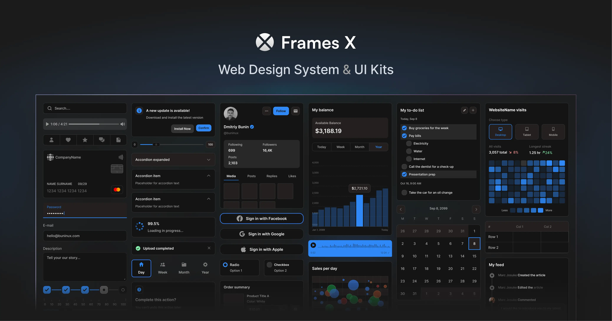

# Frames X — Figma UI Kit & Design System

**Enterprise-Ready Figma UI Kit & Design System**

[Explore the Figma UI Kit →](https://framesxdesign.com) · [Figma components library](https://framesxdesign.com/figma-components) · [Pricing](https://framesxdesign.com/pricing)

---

Frames X is the most powerful and comprehensive UI Kit for Figma. Built for startups, agencies, and enterprise teams. Whether you're building websites, SaaS dashboards, or complex design systems, Frames X gives you the speed and consistency to scale your design output.

## Core Features

- 🧩 **3,500**+ responsive components & variants.
- 🖥️ Designed for web apps, SaaS, and enterprise systems.
- 🎯 Built with Figma Variables, Auto Layout, and Component Properties.
- 🚀 Production-ready templates for fast prototyping.
- 📦 Design tokens & Dark/Light themes included.
- 🧑‍💻 Developer-friendly handoff and documentation.
- 🔄 Continuous updates with new sections and use-cases.

## Design and code unified

Frames X UI Kit components are available as a separate package via [CocoKits Tools](https://github.com/coco-base/cocokits). To get started, please install the CocoKits React or Angular components and the Frames X UI Kit theme [Install Frames X Theme](https://www.npmjs.com/package/@cocokits/theme-frames-x).

## Frames X UI Kit Use Cases

- Design scalable B2B products.
- Rapidly prototype complex user flows.
- Maintain consistency across large teams.
- Save weeks building your startup from scratch.

**Frames X UI Kit will help you to:**

- Speed up UI/UX production time.
- Ensure design consistency across content-heavy sites.
- Create visually stunning landing pages and SaaS apps.

## Commercial License

You may use Frames X UI Kit to create unlimited commercial and personal projects while your license is active. This includes:

- Websites and SaaS dashboards  
- Digital and physical end products  
- Internal tools, client projects, and marketing assets

[Learn more about the license →](https://framesxdesign.com/legal)

## Get Started with Frames X UI Kit

Download the UI Kit and start designing today:

- [Frames X — Premium Figma UI Kit](https://framesxdesign.com)
- [Browse the Figma components library](https://framesxdesign.com/figma-components)
- [Free Figma design resources](https://framesxdesign.com/design-resources)
- [What's new in Frames X 2.5](https://framesxdesign.com/learn/framesx-25)

---

_© BuninUX LLC – Frames X is a trademark of BuninUX. All rights reserved._
